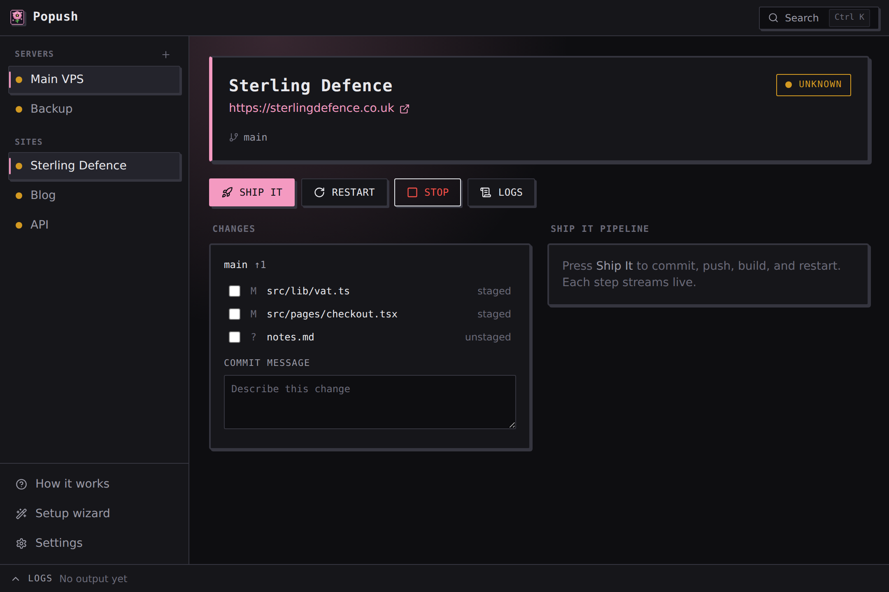
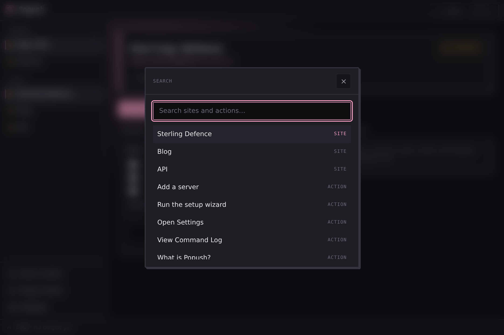

<div align="center">


# Popush

**Your VPS, one click away.**

A native Linux desktop app that connects to your servers over SSH, shows honest
live status for every site, and turns deploy, restart, logs, commit, and push
into buttons. Its headline feature, **Ship It**, takes uncommitted local code all
the way to a verified-live site in one action.

No account. No telemetry. No cloud. Your config is plain TOML on your machine.

</div>



## Install

All three paths end the same way: a **Popush** icon in your launcher and on your
Desktop.

**One command** (downloads the ready-to-run app, nothing to compile):

```sh
curl -fsSL https://raw.githubusercontent.com/twosteppy/popush/main/get-popush.sh | bash
```

**Download and double-click:** grab the `.AppImage` from
[Releases](https://github.com/twosteppy/popush/releases/latest), make it
executable (`chmod +x Popush*.AppImage`), and run it. Fedora users can install the
`.rpm` with `sudo dnf install ./Popush*.rpm`.

**Build from source:**

```sh
git clone https://github.com/twosteppy/popush.git
cd popush && bash install.sh
```

First run: if you have no SSH key yet, make one with `ssh-keygen -t ed25519`, then
click **Add your first server**.

## Ship It

Ship It chains the whole release in one click: commit, push, pull on the server,
build, restart, and a health check. Every remote command is shown exactly as it
ran, so you always know what happened.

Press `Ctrl K` for the command palette to jump to any site or action.




## Privacy

Popush collects nothing. No telemetry, no analytics, no crash reporting, no update
check, no phone-home. There is no Popush server and no account.

The only network traffic Popush makes is the SSH and git connections you
configure, plus optional read-only calls to `api.github.com` using a token you
provide. Everything it knows lives in `~/.config/popush/config.toml`, in plain
text, with no secrets. SSH key passphrases are never handled by Popush; it
delegates to `ssh-agent`.

## The honest weakness

Popush runs commands on your servers. Anyone who can edit your config file can
make it run their commands on your servers. Shell escaping stops injection through
values, but a `build_command` is a command you asked Popush to run. Protect your
config file the way you protect `~/.ssh`.

## Building

Popush is a Cargo workspace: `popush-core` holds all logic and builds anywhere;
`src-tauri` is the Tauri v2 shell and links WebKitGTK (Linux only).

```sh
sudo dnf install webkit2gtk4.1-devel gtk3-devel libappindicator-gtk3-devel librsvg2-devel
pnpm install --ignore-scripts
cargo test -p popush-core
pnpm tauri dev        # or: pnpm tauri build
```

Target platform: Fedora 44 with KDE Plasma. Linux only, by design.

## Licence

[GPL-3.0](LICENSE). Accountless, no telemetry, free forever, and licensed so a
closed fork cannot strip those away.

Built by twostep.
